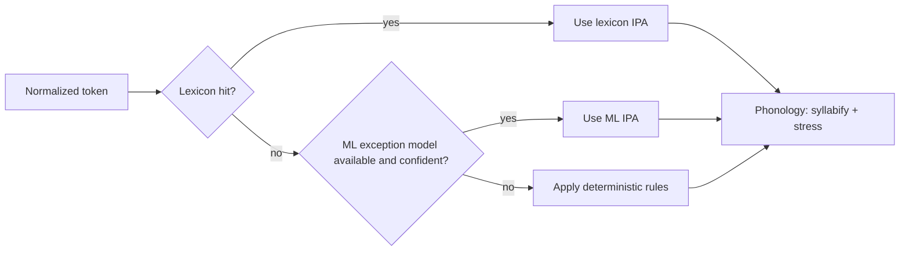

# Project Architecture

FurlanG2P uses a hybrid G2P architecture: lexicon-first lookup, deterministic
rules as a guaranteed fallback, and an optional ML exception interface designed
to sit between the two when enabled.

## Module map

| Package | Responsibility | Key components | Maturity |
| --- | --- | --- | --- |
| `core` | shared interfaces and cross-cutting contracts | `IG2PPhonemizer`, `IEvaluator`, `ILexiconBuilder` | stable |
| `config` | dataclass configs and JSON/YAML loaders | `load_normalizer_config`, `load_tokenizer_config` | prototype |
| `normalization` | deterministic text normalization | `Normalizer`, number/unit/abbreviation expansion | prototype |
| `tokenization` | sentence and word tokenization | `Tokenizer.split_sentences`, `Tokenizer.split_words` | prototype |
| `g2p` | runtime lookup/rule conversion used by the main pipeline | `Lexicon`, `G2PPhonemizer`, `PhonemeRules` | experimental |
| `lexicon` | lexicon schema, ingestion, canonicalization, lookup, and storage I/O | `LexiconEntry`, `LexiconBuilder`, `DialectAwareLexicon` | experimental |
| `evaluation` | quality metrics for predicted vs gold IPA | `Evaluator`, `EvaluationResult`, `WordResult` | experimental |
| `ml` | optional ML exception-model interface and null default implementation | `IExceptionModel`, `ExceptionPrediction`, `NullExceptionModel` | interface stable, model impl pending |
| `phonology` | IPA canonicalization plus syllable/stress processing | `canonicalize_ipa`, `Syllabifier`, `StressAssigner` | experimental |
| `services` | orchestration layer for text/CSV processing | `PipelineService` | stable |
| `cli` | click-based command adapters | `normalize`, `g2p`, `ipa`, `lexicon`, `evaluate`, `coverage` | stable |
| `data` | packaged linguistic assets | `seed_lexicon.tsv`, `ipa_mapping.tsv` | seed |
| `docs` | architecture/usage/business references | markdown docs in `docs/` | evolving |
| `tests` | regression and CLI coverage | pytest suites for pipeline, lexicon, CLI | evolving |

## Hybrid lookup flow

Current implementation detail:
- `ml.NullExceptionModel` is the default and always returns `None`.
- In base installs, runtime behavior is effectively `lexicon -> rules`.
- The `ml` package provides the stable interface needed to activate the
  `lexicon -> ML -> rules` path when a real model is integrated.

## Evaluation package

Purpose:
- Provide objective quality reporting for G2P outputs on gold sets.

Components:
- `evaluation.types.WordResult`: per-word correctness and phoneme distance.
- `evaluation.types.EvaluationResult`: aggregate metrics (`wer`, `per`,
  `stress_accuracy`, counts, details).
- `evaluation.metrics.Evaluator`: computes metrics from in-memory pairs or TSV
  inputs.

Interfaces:
- Implements `core.interfaces.IEvaluator`.
- Consumed by CLI `evaluate` command and integration tests.

## Lexicon package

Purpose:
- Build, normalize, validate, persist, and query large pronunciation lexicons.

Schema:
- `LexiconEntry` fields: `lemma`, `ipa`, `dialect`, `source`, `confidence`,
  `frequency`, `alternatives`.
- `LexiconConfig` controls lookup behavior (`default_dialect`,
  `fallback_to_universal`, `case_sensitive`, `return_alternatives`).

Storage:
- `storage.read_tsv` / `write_tsv` for simple and extended TSV formats.
- `storage.read_jsonl` / `write_jsonl` for full-fidelity interchange.
- `storage.detect_format` for extension-based format detection.

Builder and ingestion:
- `LexiconBuilder` merges multi-source entries and keeps alternatives.
- `wikipron.iter_wikipron_entries` parses WikiPron TSV rows.
- `canonicalizer.IPACanonicalize` normalizes symbols to project inventory and
  flags unknown IPA segments.

Runtime lookup:
- `lookup.DialectAwareLexicon` supports `(lemma, dialect)` lookup with
  configurable fallback to universal entries.
- `g2p.lexicon.Lexicon` provides backward-compatible runtime APIs over the same
  dialect-aware backend.

## ML package

Purpose:
- Define an optional, pluggable exception-model contract without adding ML
  dependencies to base installs.

Components:
- `ml.interfaces.IExceptionModel`:
  `predict`, `predict_batch`, `is_available`, `get_model_info`.
- `ml.interfaces.ExceptionPrediction`: IPA prediction with confidence and
  optional alternatives.
- `ml.null_model.NullExceptionModel`: safe default implementation.
- `ml.__init__.ML_AVAILABLE` and `require_ml()` import guards.

Packaging:
- Base install: `pip install furlang2p` (no torch/transformers).
- Optional ML install: `pip install furlang2p[ml]`.

## Dialect conditioning

Dialect is treated as metadata/conditioning in a single codebase:
- Lexicon entries can be dialect-specific (`central`, `western`, `carnic`) or
  universal (`None`).
- Lookup supports alias normalization (for example `west -> western`,
  `carnia -> carnic` on schema-facing paths, with rule-engine mapping to its
  internal dialect labels).
- Pipeline defaults can be set globally (`PipelineService(default_dialect=...)`)
  and overridden per request (`process_text(..., dialect=...)`).
- `process_csv` also accepts `dialect_column` to drive row-level conditioning.

## Service and CLI integration

- `PipelineService` orchestrates:
  `normalization -> tokenization -> g2p -> syllabification -> stress`.
- CLI commands are thin adapters over library modules:
  `lexicon` group for lexicon lifecycle, `evaluate` for quality metrics, and
  `coverage` for lexicon/rule coverage classification.
